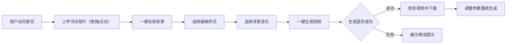

## 1. 产品概述

书法作品视频生成平台，支持用户上传书法图片，一键去除背景、添加画框、选择音乐，生成精美的15秒内书法展示视频。

- **目标用户**：书法爱好者、传统文化创作者、社交媒体内容创作者
- **核心价值**：降低书法作品数字化传播门槛，让普通用户无需专业技能即可制作高质量的书法展示视频

## 2. 核心功能

### 2.1 用户角色

| 角色 | 方式 | 核心权限 |
|------|------|----------|
| 普通用户 | 直接访问 | 上传书法图片、去除背景、选择画框和音乐、生成视频、下载结果 |

### 2.2 功能模块

1. **首页工作台**：图片上传区、背景去除、画框选择、音乐选择、视频生成、预览下载
2. **作品库**：已生成的作品列表与管理

### 2.3 页面详情

| 页面名称 | 模块名称 | 功能描述 |
|----------|----------|----------|
| 首页工作台 | 图片上传区 | 支持拖拽上传和点击上传书法图片，支持JPG/PNG格式 |
| 首页工作台 | 背景去除 | 一键去除书法背景，仅保留文字，支持实时预览 |
| 首页工作台 | 画框选择 | 免费画框库，包含空白卷轴、传统画框等，选择后实时预览视觉效果 |
| 首页工作台 | 音乐选择 | 免费音乐库，提供多种古风、轻音乐选择，支持试听 |
| 首页工作台 | 视频生成 | 一键生成15秒内视频动效，展示书法效果，包含进度显示 |
| 首页工作台 | 预览下载 | 视频生成完成后可预览，支持下载保存 |

## 3. 核心流程

### 3.1 图片上传流程
1. 用户通过拖拽或点击选择书法图片文件
2. 系统显示上传进度条
3. 上传完成后显示图片预览
4. 进入背景去除阶段

### 3.2 背景去除流程
1. 用户点击"去除背景"按钮
2. 系统处理图片，识别并去除背景
3. 保留书法文字，显示处理后效果
4. 进入画框选择阶段

### 3.3 画框选择流程
1. 用户从画框库中选择喜欢的画框样式
2. 系统实时预览画框与书法的组合效果
3. 进入音乐选择阶段

### 3.4 音乐选择流程
1. 用户从音乐库中浏览可用音乐
2. 点击试听按钮可预览音乐
3. 确定选择后进入视频生成阶段

### 3.5 视频生成流程
1. 用户点击"一键生成视频"按钮
2. 系统显示生成进度（0-100%）
3. 生成15秒内的书法展示视频，包含动效
4. 生成完成后自动显示预览和下载按钮

## 4. 用户界面设计

### 4.1 设计风格

- **主色调**：传统水墨色（`#1A1A1A`深灰、`#FFFFFF`白色），搭配雅致的赭石色（`#C19A6B`）和墨绿色（`#2C5F2D`）
- **辅色调**：浅金色（`#D4AF37`）用于强调按钮，传递传统文化韵味
- **字体方案**：标题使用`Noto Serif SC`（思源宋体），正文使用`Noto Sans SC`（思源黑体）
- **按钮风格**：圆角矩形，传统边框纹样，悬停时有微妙的阴影效果
- **布局风格**：左右分栏布局，左侧操作区，右侧预览区，整体简洁典雅
- **整体调性**：传统雅致风格，融合现代交互体验

### 4.2 页面设计概览

| 页面名称 | 模块名称 | UI元素 |
|----------|----------|--------|
| 首页工作台 | 顶栏 | Logo（左侧）、产品名称、帮助提示 |
| 首页工作台 | 上传区域 | 虚线边框拖拽区、毛笔图标、上传按钮、格式提示 |
| 首页工作台 | 背景去除 | 处理前后对比图、去除背景按钮 |
| 首页工作台 | 画框选择 | 横向滚动画框卡片网格，每张卡片包含画框预览图、名称、选中状态 |
| 首页工作台 | 音乐选择 | 音乐列表卡片，包含播放/暂停按钮、音乐名称、时长 |
| 首页工作台 | 生成按钮 | 大尺寸传统风格按钮、加载动画、进度百分比显示 |
| 首页工作台 | 预览区 | 视频播放器、下载按钮 |

### 4.3 响应式设计

- 桌面优先设计，主界面针对 1440px+ 宽屏优化
- 平板端（768px-1024px）调整为上下布局
- 移动端（<768px）精简UI元素，操作流程分步骤引导

### 4.4 动效设计

- 页面加载时元素依次淡入
- 上传区域拖拽悬浮时产生柔和光晕
- 画框卡片选中时有缩放动画
- 视频生成过程中有进度条动画
- 书法展示视频包含优雅的文字渐显动效
