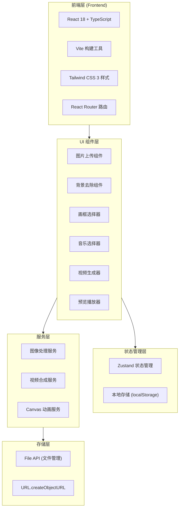

## 1. 架构设计



## 2. 技术方案说明

- **前端框架**：React@18 + TypeScript
- **构建工具**：Vite
- **样式方案**：Tailwind CSS 3
- **路由方案**：React Router v6
- **状态管理**：Zustand
- **字体方案**：Noto Serif SC（标题）、Noto Sans SC（正文）
- **图标方案**：Lucide React 图标库
- **图像处理**：Canvas API + 像素处理算法
- **视频合成**：MediaRecorder API + Canvas 帧录制
- **存储方案**：localStorage（用户偏好设置）

## 3. 路由定义

| 路由 | 页面 | 说明 |
|------|------|------|
| / | 首页工作台 | 主操作界面：上传、背景去除、画框选择、音乐选择、视频生成、预览下载 |
| /gallery | 作品库 | 用户已生成的书法视频作品管理 |

## 4. 组件架构

### 4.1 核心组件树

```
App
├── Header (顶栏)
│   ├── Logo
│   ├── NavLinks (导航链接)
│   └── HelpIcon (帮助提示)
├── Routes
│   ├── HomePage (首页工作台)
│   │   ├── UploadZone (图片上传区域)
│   │   │   ├── DragDropTarget (拖拽目标)
│   │   │   └── FileInput (文件选择)
│   │   ├── BackgroundRemover (背景去除)
│   │   │   ├── BeforeAfterPreview (处理前后对比)
│   │   │   └── RemoveBgButton (去除背景按钮)
│   │   ├── FrameSelector (画框选择)
│   │   │   ├── FrameCard (画框卡片 × N)
│   │   │   └── FramePreview (画框预览)
│   │   ├── MusicSelector (音乐选择)
│   │   │   ├── MusicCard (音乐卡片 × N)
│   │   │   └── PlayButton (播放按钮)
│   │   ├── GenerateButton (视频生成)
│   │   │   └── ProgressBar (进度条)
│   │   └── PreviewPlayer (预览播放器)
│   │       ├── VideoPlayer (视频播放器)
│   │       └── DownloadButton (下载按钮)
│   └── GalleryPage (作品库)
│       ├── GalleryCard (作品卡片 × N)
│       └── EmptyState (空状态)
└── Footer (页脚)
```

### 4.2 状态管理设计

```typescript
// 应用全局状态类型
interface AppState {
  // 图片相关
  originalImage: File | null;
  originalImageUrl: string | null;
  processedImage: string | null;  // 去除背景后的图片
  
  // 画框相关
  selectedFrame: Frame | null;
  frames: Frame[];
  
  // 音乐相关
  selectedMusic: Music | null;
  musicList: Music[];
  isMusicPlaying: boolean;
  
  // 视频生成
  isGenerating: boolean;
  generationProgress: number;
  generatedVideo: string | null;
  
  // 作品历史
  history: HistoryItem[];
  
  // Actions
  setOriginalImage: (file: File | null) => void;
  setProcessedImage: (url: string | null) => void;
  setSelectedFrame: (frame: Frame | null) => void;
  setSelectedMusic: (music: Music | null) => void;
  setIsMusicPlaying: (playing: boolean) => void;
  setIsGenerating: (generating: boolean) => void;
  setGenerationProgress: (progress: number) => void;
  setGeneratedVideo: (url: string | null) => void;
  addToHistory: (item: HistoryItem) => void;
  removeFromHistory: (id: string) => void;
}

interface Frame {
  id: string;
  name: string;
  nameZh: string;
  previewImage: string;
  category: 'scroll' | 'frame' | 'simple';
}

interface Music {
  id: string;
  name: string;
  nameZh: string;
  duration: number;  // 秒
  url: string;
  category: 'ancient' | 'light' | 'piano';
}

interface HistoryItem {
  id: string;
  originalImageName: string;
  selectedFrame: Frame;
  selectedMusic: Music;
  thumbnailUrl: string;
  videoUrl: string;
  timestamp: number;
}
```

## 5. 核心功能实现

### 5.1 背景去除算法

使用Canvas API实现简单的背景去除：
1. 读取图片像素数据
2. 计算亮度阈值区分背景和文字
3. 将背景像素设为透明
4. 输出处理后的PNG图片

```typescript
function removeBackground(image: HTMLImageElement): string {
  const canvas = document.createElement('canvas');
  canvas.width = image.width;
  canvas.height = image.height;
  const ctx = canvas.getContext('2d')!;
  ctx.drawImage(image, 0, 0);
  
  const imageData = ctx.getImageData(0, 0, canvas.width, canvas.height);
  const data = imageData.data;
  
  // 计算平均亮度作为阈值
  let totalBrightness = 0;
  for (let i = 0; i < data.length; i += 4) {
    const r = data[i];
    const g = data[i + 1];
    const b = data[i + 2];
    totalBrightness += (r + g + b) / 3;
  }
  const threshold = totalBrightness / (data.length / 4);
  
  // 处理像素
  for (let i = 0; i < data.length; i += 4) {
    const r = data[i];
    const g = data[i + 1];
    const b = data[i + 2];
    const brightness = (r + g + b) / 3;
    
    // 如果亮度接近阈值，设为透明
    if (brightness > threshold * 0.7) {
      data[i + 3] = 0;  // 透明
    }
  }
  
  ctx.putImageData(imageData, 0, 0);
  return canvas.toDataURL('image/png');
}
```

### 5.2 画框系统

画框使用CSS叠加方式实现：
- 使用绝对定位的div容器
- 背景图作为画框
- 书法图片居中显示在画框内
- 支持多种画框样式（卷轴、传统画框等）

### 5.3 视频生成

使用Canvas逐帧绘制动画，然后用MediaRecorder录制：
1. 创建Canvas画布
2. 逐帧绘制书法展示动画（渐显、平移、缩放等）
3. 使用MediaRecorder录制Canvas流
4. 合并背景音乐
5. 输出WebM或MP4格式视频

```typescript
async function generateVideo(
  calligraphyImage: string,
  frame: Frame,
  music: Music,
  duration: number = 10
): Promise<Blob> {
  // 实现视频生成逻辑
}
```

## 6. 数据模型

### 6.1 预置画框数据

```typescript
export const frames: Frame[] = [
  {
    id: 'scroll-1',
    name: 'Blank Scroll',
    nameZh: '空白卷轴',
    previewImage: '/frames/scroll-1.svg',
    category: 'scroll'
  },
  {
    id: 'frame-1',
    name: 'Traditional Frame',
    nameZh: '传统画框',
    previewImage: '/frames/frame-1.svg',
    category: 'frame'
  },
  // 更多画框...
];
```

### 6.2 预置音乐数据

```typescript
export const musicList: Music[] = [
  {
    id: 'ancient-1',
    name: 'Plum Blossom',
    nameZh: '梅花三弄',
    duration: 180,
    url: '/music/ancient-1.mp3',
    category: 'ancient'
  },
  {
    id: 'light-1',
    name: 'Serene Bamboo',
    nameZh: '竹林静思',
    duration: 120,
    url: '/music/light-1.mp3',
    category: 'light'
  },
  // 更多音乐...
];
```
